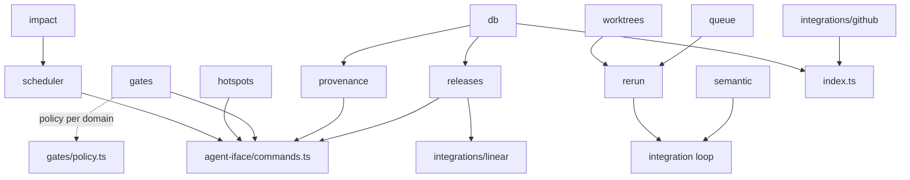

# Architecture

harbormaster is a coordination layer for a fleet of AI coding agents working
one repository. It does three things, in order of importance: schedule work
so agents rarely collide, integrate optimistically through a merge queue so
the rare collision is cheap, and formalize release/gate policy so the whole
loop stays on the record. This document maps the spec's architecture
(`spec.md`) onto the actual source tree, explains how data and control flow
through a dispatch, and calls out the trade-offs behind the non-obvious
decisions.

## Component map

```
harbormaster/
  scheduler/         impact estimation → parallel/sequence/merge dispatch plan
  impact/            impact surface estimation + Jaccard overlap scoring
  integration/
    worktrees/       per-task git worktrees off the current tip
    queue/           adapter over GitHub's native merge queue
    semantic/        cross-branch tsc typecheck conflict detection
    rerun/           re-dispatch the losing side of a failed integration
  hotspots/          advisory leases for the declared un-mergeable set
  release/           ported release.sh: branch, tag, hotfix, sync-develop
  gates/             scope / CI / QA / HITL pipeline, per-domain policy
  provenance/        immutable audit log (Postgres-backed)
  releases/          Linear-planned releases: manifests, notes, freeze windows
  integrations/
    github/          GitHub App: webhooks, no-direct-push observability
    linear/          Linear GraphQL client + ticket sync
  agent-iface/
    schemas.ts        zod schemas shared by both surfaces below
    commands.ts        one function per agent-facing operation
    cli/              single-shot CLI (`harbormaster <cmd> '<json>'`)
    mcp/              MCP server, one tool per command, stdio transport
  db/                Postgres pool singleton + migration runner + schema types
  config.ts          zod-validated environment schema
  index.ts           control-plane process entry point
```

This is a direct implementation of the tree in `spec.md`'s Architecture
section — every top-level directory named there exists, with one addition
(`db/`, factored out of `release/` because migrations and the connection
pool are shared by `provenance/`, `releases/`, and the control-plane process,
not owned by any single module).

### Module dependency graph



Two things this graph makes explicit:

- **`agent-iface/commands.ts` is the seam.** Every domain module (scheduler,
  hotspots, gates, provenance, releases) is a plain, dependency-injected
  class with no knowledge of the CLI or MCP. `commands.ts` is the only place
  that wires them to a transport, which is what let M0–M8 each ship as an
  independently testable library before M9 exposed any of it to an agent.
- **The integration loop (worktrees/queue/semantic/rerun) has no direct line
  to the scheduler.** The scheduler decides *what* runs when; the
  integration package handles *what happens when a dispatch lands*. They
  share only the `dispatchId`/`branch` identifiers that flow through
  provenance — deliberately, so the merge-queue mechanics can be tested and
  reasoned about without a scheduler in the loop at all.

## Data and control flow

### 1. Plan a wave

```
Linear tickets → LinearClient.listTeamIssues → TicketSyncer → tickets table
                                                      │
                                                      ▼
                              ImpactEstimator.estimate (per ticket)
                                        │
                                        ▼
                         Scheduler.plan(tickets, surfaces) → DispatchPlan
```

`ImpactEstimator` (`src/impact/index.ts`) turns a ticket into an
`ImpactSurface` — files, derived directories, and derived domains — with a
confidence score that depends on how the surface was derived: explicit
`expectedFiles` (1.0), labels (0.6), or free-text keyword matches against
`DEFAULT_DOMAIN_MAP` (0.3). `Scheduler.plan` (`src/scheduler/index.ts`) then
does two passes over every ticket pair, scored by `computeOverlap` (Jaccard
on files, falling back to directory containment, falling back to domain
overlap when file-level data is thin):

1. **Union-find clustering.** Pairs scoring at or above `mergeThreshold`
   collapse into one `ScheduledGroup` with `decision: 'merge'` — the
   scheduler's strongest move, because it removes the possibility of the
   collision entirely by handing both tickets to one agent as a single job.
2. **Kahn's topological sort over the remaining groups.** Pairs scoring
   above `sequenceThreshold` (but below merge) become a dependency edge; a
   group with an in-degree of zero can run in the current wave, and clearing
   it unlocks its dependents. Groups with no edges at all land in the same
   wave and are marked `parallel`.

The result, a `DispatchPlan`, is the schedule-first mechanism the spec calls
the "novel, portfolio-worthy part": most collisions are prevented by never
dispatching the two conflicting tickets concurrently, rather than by
detecting and resolving them after the fact.

### 2. Dispatch and integrate

```
dispatch → WorktreeManager.create (git worktree add -b <branch> <path> <base>)
              │
              ▼
        agent works in the worktree, opens a PR
              │
              ▼
        GitHubMergeQueueAdapter.enqueue (enablePullRequestAutoMerge)
              │
              ▼
   GitHub's native merge queue: rebase → CI on the *rebased* result → merge
              │
        ┌─────┴─────┐
     green            red / rebase conflict
        │                  │
        ▼                  ▼
   gates.run          Rerunner.handleFailure
   (see below)          │  cleanup (remove worktree, dequeue)
                         │  currentTip(baseBranch)
                         │  redispatch() → new dispatchId/branch
                         │  worktrees.create off the new tip
                         ▼
                   re-enters the queue as a fresh attempt
```

harbormaster deliberately does not reimplement the merge queue. `WorktreeManager`
gives each dispatch physical isolation (its own working directory and
branch off the current tip); `GitHubMergeQueueAdapter` just flips
`enablePullRequestAutoMerge` and lets GitHub's queue do the
serialize-rebase-CI-merge work. `Rerunner` is the piece that closes the
loop when that queue reports a loss: it doesn't retry blindly — it resolves
the *current* tip (which has moved since the failed attempt started) so the
redispatch is against fresh state, not the state that just failed.

`SemanticConflictDetector` (`src/integration/semantic/index.ts`) runs
alongside this path rather than inside it: given a set of in-flight
branches, it runs `tsc --noEmit` per branch in its worktree, parses the
output into structured `TypeScriptError` records, and cross-references
which branches error in files another branch touches. This is the spec's
"CI-on-the-merged-result already approximates this; making it explicit is
strictly more useful than any area lock" — it catches the case a file-level
lock never would (branch A changes a function signature, branch B's caller
now fails to typecheck, and neither branch's own CI would have caught it in
isolation).

### 3. Hotspots — the exception, not the architecture

`HotspotLeaseManager` (`src/hotspots/index.ts`) is intentionally the
smallest and least central module. `check(files)` is a free, lock-free
query available to anyone; `acquire(request)` only blocks when the request's
files actually match a registered hotspot glob (a migrations directory, a
shared contract file). Everything outside the declared hotspot set never
touches this module at all — there is no default lock, only opt-in ones,
which is the point: the spec inverts pessimistic locking as the primary
mechanism and keeps it only for the ~5% of paths where a redo is genuinely
expensive (a database migration, a shared interface).

### 4. Gates

```
GatePipelineInput → scope → ci → qa (if policy.requiresQA) → hitl (if policy.requiresHITL)
```

`resolvePolicy` (`src/gates/policy.ts`) picks the *strictest* matching
policy across every domain a dispatch's impact surface touches — e.g. a
change spanning `docs/` and `db/` resolves to `db`'s high-risk policy, not
an average of the two. `GatePipeline.run` (`src/gates/pipeline.ts`)
short-circuits on the first failing stage and records every stage as
`pass`/`fail`/`skip` (a stage with no configured runner, e.g. no `runQA`
callback on a low-risk policy, is recorded `skip` rather than silently
omitted, so the audit trail always has four entries). Domain risk currently
ranges from `docs`/`readme` (low: no QA, no HITL, wide scope-drift
tolerance) through most application code (medium: CI + QA) to `db/`,
`hotspots/`, and `provenance/` (high: CI + QA + HITL, tight scope-drift
threshold) — see `POLICY_TABLE` for the full table.

### 5. Provenance and releases

Every dispatch, gate decision, and release transition that reaches
Postgres does so through one of four tables (`src/db/migrations/001_initial.sql`):
`audit_log`, `tickets`, `dispatches`, `gate_decisions`, `releases`.
`ProvenanceRecorder` is an append-only writer over `audit_log` — there is no
update or delete path, by design, so the trail from ticket → dispatch →
gate decision → merge is always reconstructable (`getTrail(ticketId)` walks
it end to end). `ReleaseManager.buildManifest` pulls tickets for a Linear
team/cycle, groups them by status and priority for the manifest summary, and
`generateNotes` is a pure function over that manifest that buckets tickets
into Features/Fixes/Improvements/Other by label — kept pure and separate
from `buildManifest`'s I/O so notes generation is trivially unit-testable
and re-runnable without hitting Linear again.

### 6. Agent interface

`agent-iface/schemas.ts` defines one zod schema per operation; both the CLI
(`agent-iface/cli/index.ts`) and the MCP server (`agent-iface/mcp/server.ts`)
validate against the same schema and call the same function in
`commands.ts`, so the two surfaces are guaranteed to agree on request/response
shape (see `docs/api.md` for the full command reference). Stateful commands
(hotspot leases) default to a process-wide singleton manager so state
persists across calls within one long-running MCP session, while still
accepting an injected manager for tests — the same dependency-injection
pattern used throughout the codebase (`ReleaseManager`'s injectable
`ReleasesPool`, `LinearClient`'s injectable `FetchFn`, `Rerunner`'s injected
`SimpleGit`) specifically so every module is unit-testable without a live
Postgres, GitHub, or Linear connection.

## Key design decisions and trade-offs

- **Schedule-first, not lock-first.** The core bet of the spec: since an
  agent's redo cost is minutes and pennies, pessimistic per-file locking
  optimizes for the wrong cost (blocking cheap workers to avoid a cheap
  loss) while missing the conflicts that actually hurt (cross-file signature
  breaks). The scheduler's merge/sequence/parallel decision runs *before*
  any lock would even apply, so most collisions are structurally impossible
  rather than detected-and-recovered.
- **Wrap, don't rebuild, the merge queue.** `GitHubMergeQueueAdapter` is a
  thin GraphQL/REST wrapper (`enablePullRequestAutoMerge`) instead of a
  bespoke rebase-and-merge implementation. The trade-off is a GitHub-only
  integration for now (the `QueueAdapter` interface exists so a Mergify or
  Graphite adapter could be added without touching `Rerunner` or the
  scheduler).
- **Injected I/O everywhere.** Every module that touches Postgres, GitHub,
  or Linear takes its client as a constructor/factory parameter
  (`ReleasesPool`, `OctokitLike`, `FetchFn`, `ExecFn`, `ClockFn`, `GitFactory`)
  rather than importing a global. This is why 318 tests run in ~2.5 seconds
  with no live services: the trade-off is more constructor parameters and
  factory functions in exchange for a fully offline test suite.
- **CLI and MCP as adapters, not sources of logic.** All agent-facing
  behavior lives in `commands.ts`, validated by schemas shared with both
  transports. This guarantees CLI/MCP parity by construction (there's no
  code path where one surface accepts a request the other would reject) at
  the cost of an extra indirection layer between a transport handler and the
  underlying class.
- **Strictest-domain gate resolution.** `resolvePolicy` picking the
  strictest policy across a dispatch's touched domains, rather than the
  policy of the "primary" domain, means a small docs edit bundled into a
  migration PR still gets the migration's HITL gate — a deliberate bias
  toward false positives (unnecessary human review) over false negatives (a
  risky change slipping through because it also touched something low-risk).
- **Provenance is append-only.** `ProvenanceRecorder` has no update/delete
  method. This trades storage growth and the inability to "correct" a
  historical record for an audit log that is actually trustworthy as a
  record of what happened, which is the entire point of the spec's
  provenance requirement.

## External dependencies

| Dependency | Used by | Role |
|---|---|---|
| GitHub (REST + GraphQL, `@octokit/app`) | `integrations/github/`, `integration/queue/`, `integration/rerun/ci.ts` | GitHub App (webhooks, no-direct-push observability), native merge queue (auto-merge), CI check-run status |
| Linear (GraphQL) | `integrations/linear/`, `releases/` | Ticket source of truth, ticket status sync, release manifest source |
| Postgres (`pg`) | `db/`, `provenance/`, `releases/` (indirectly `tickets`/`dispatches`/`gate_decisions`) | Audit log and all persisted state; single pooled connection via `getPool` |
| `simple-git` | `integration/worktrees/`, `integration/rerun/rebase.ts` | Git worktree and rebase operations |
| `zod` | `config.ts`, `agent-iface/schemas.ts` | Environment validation, agent-iface request validation (shared by CLI and MCP) |
| `@modelcontextprotocol/sdk` | `agent-iface/mcp/` | MCP server over stdio |
| `semver` | `release/semver.ts` | Version bump calculation ported from `release.sh` |
| TypeScript compiler (`tsc`, via `child_process`) | `integration/semantic/` | Cross-branch semantic conflict detection |

None of the above are bundled or reimplemented — consistent with the spec's
"build vs. buy" call to wrap existing merge-queue, CI, and ticketing systems
rather than rebuild them, and to spend the build effort on the
scheduler, impact analysis, gate policy, and provenance instead.

## Spec-to-code map

| Spec section | Code |
|---|---|
| Conflict-aware scheduler (primary mechanism) | `src/impact/`, `src/scheduler/` |
| Optimistic integration via merge queue | `src/integration/worktrees/`, `src/integration/queue/`, `src/integration/rerun/` |
| Semantic-conflict detection | `src/integration/semantic/` |
| Hotspot advisory leases | `src/hotspots/` |
| Release lifecycle ported from `release.sh` | `src/release/` (`semver.ts`, `branch.ts`, `tags.ts`, `hotfix.ts`, `sync.ts`) |
| Gate pipeline (scope/CI/QA/HITL, per-domain policy) | `src/gates/` |
| Provenance / immutable audit log | `src/provenance/`, `audit_log` table |
| Release planning from Linear | `src/releases/`, `src/integrations/linear/` |
| Agent interface (CLI + MCP) | `src/agent-iface/` |
| GitHub App (no direct main pushes, required checks) | `src/integrations/github/` |

Every milestone in `PROGRESS.md` (M0–M9) maps onto exactly one row above;
there is no code outside this map and no row without code.
